# CryptoAlert
Allows for real-time tracking of a single cryptocurrency's USD price as well as configurable sound/email alerts once the price hits a custom threshold. Includes historical tracking of past alerts. All data scraped from coinmarketcap.com

Utilizes BeautifulSoup, Pandas, and Tkinter.

## Instructions ##
### First Time Setup ###

### Using CryptoAlert ###

## Screenshots ##
<table>
  <tr>
    <td align="center"><b>Idle Sceen</b></td>
     <td align="center"><b>Active Tracking</b></td>
  </tr>
  <tr>
    <td>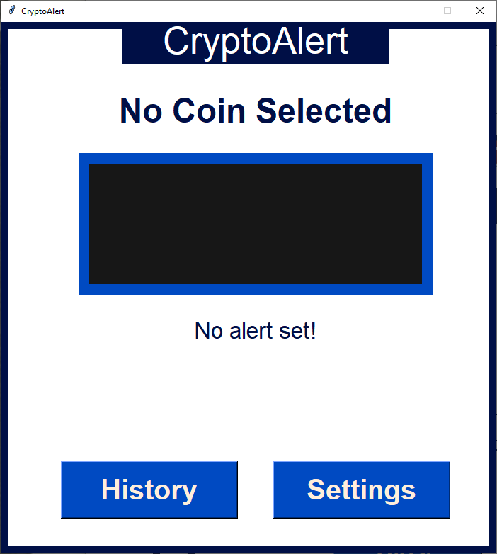
    <td>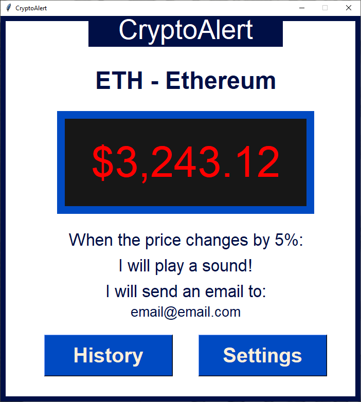
  </tr>
  <tr>
    <td align="center"><b>No Internet Error</b></td>
     <td align="center"><b>No Price Data Error</b></td>
  </tr>
  <tr>
    <td>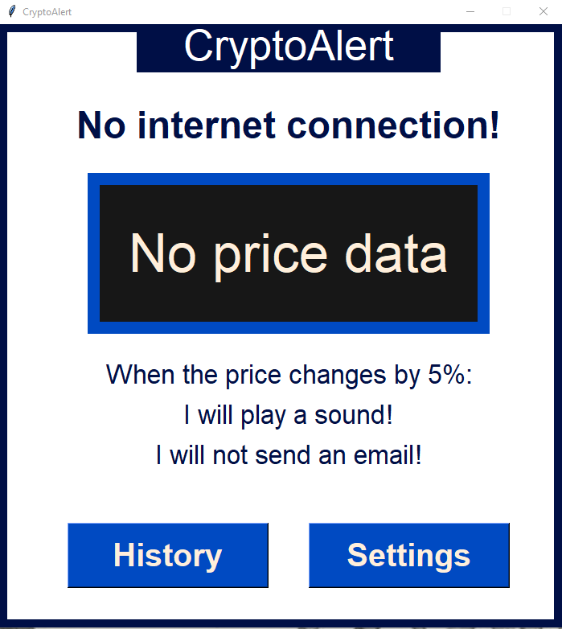
    <td>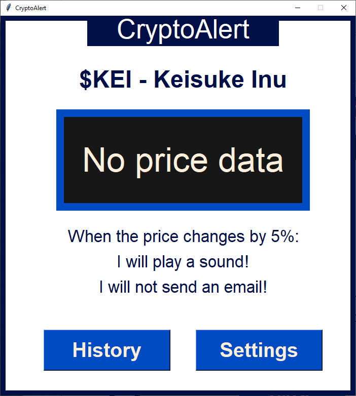
  </tr>
  <tr>
    <td align="center"><b>Alert Notification</b></td>
     <td align="center"><b>History Screen</b></td>
  </tr>
  <tr>
    <td>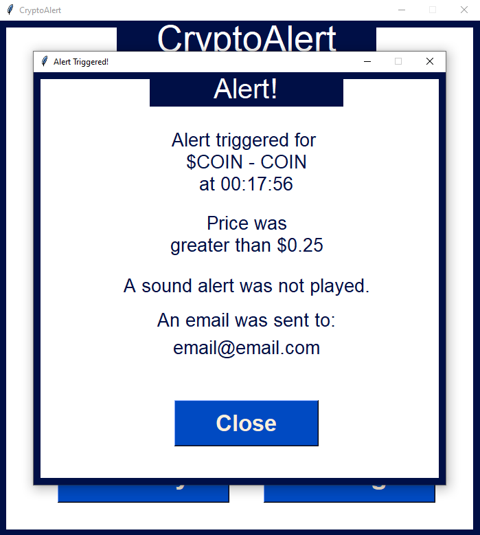
    <td>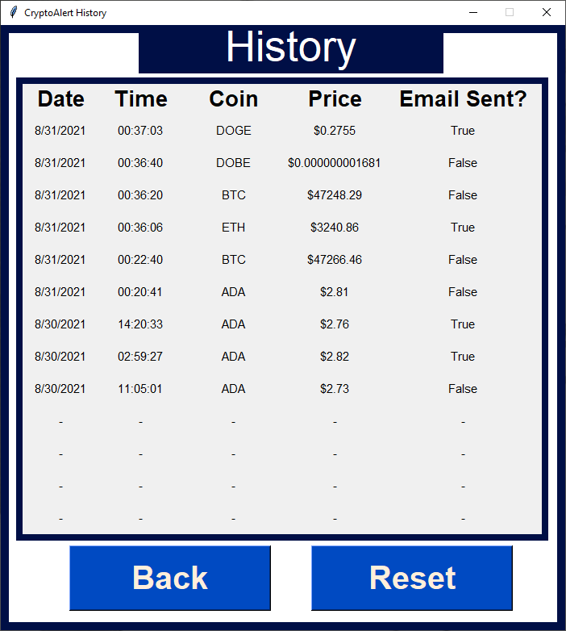
  </tr>
  <tr>
    <td align="center"><b>Settings</b></td>
     <td align="center"><b>Settings Error Example</b></td>
  </tr>
  <tr>
    <td>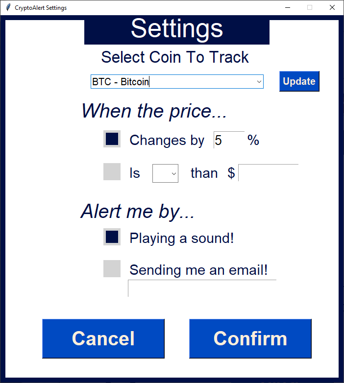
    <td>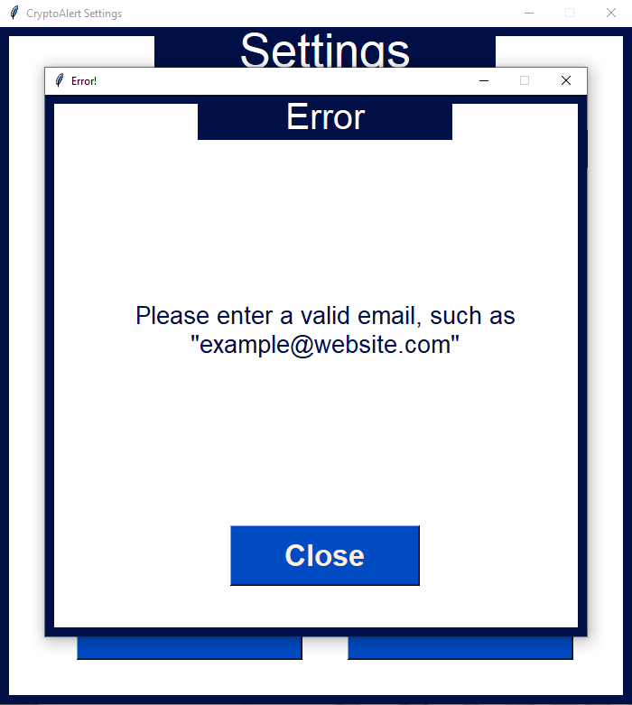
  </tr>
  <tr>
    <td align="center"><b>Update Coin List</b></td>
     <td align="center"><b>Update Running</b></td>
  </tr>
  <tr>
    <td>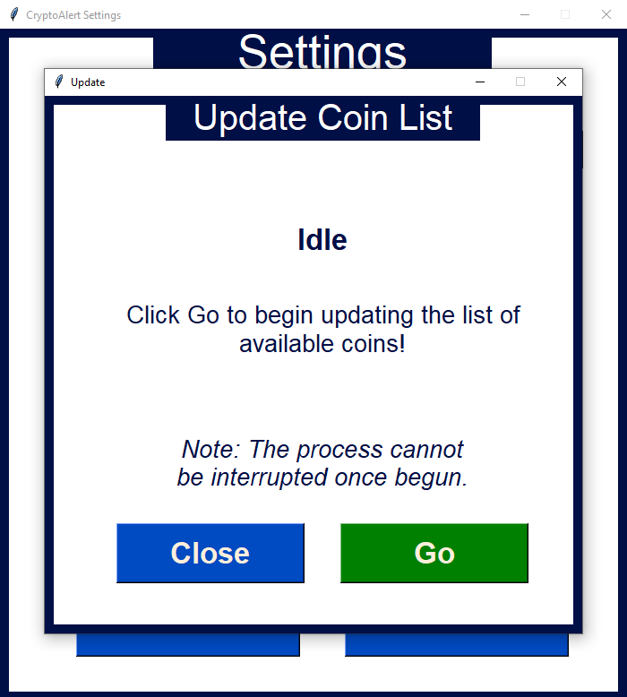
    <td>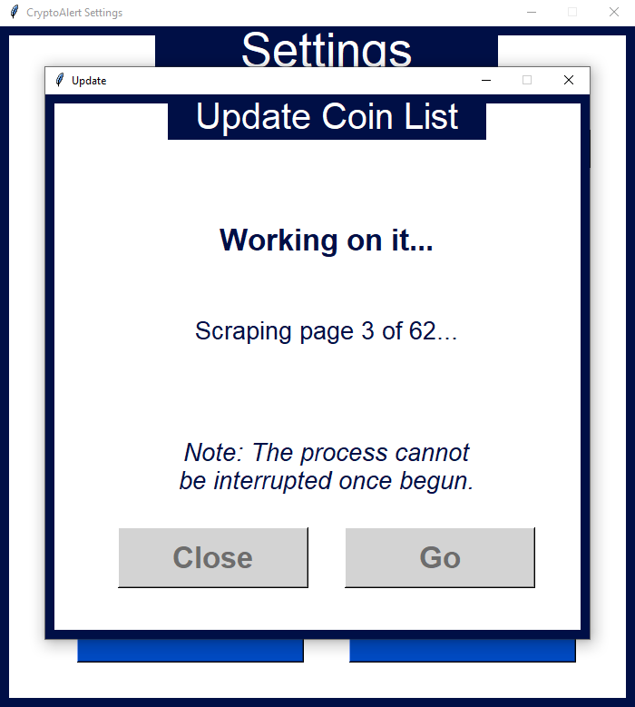
  </tr>
  <tr>
    <td align="center"><b>Update Error</b></td>
     <td align="center"><b>Update Done</b></td>
  </tr>
  <tr>
    <td>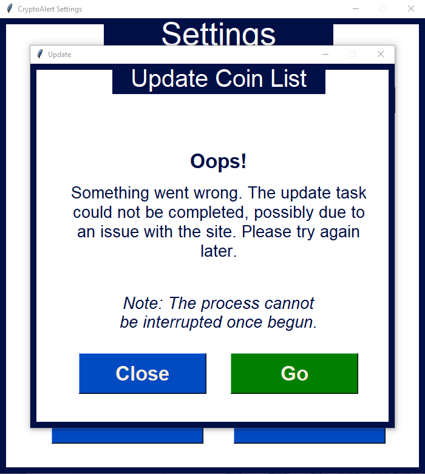
    <td>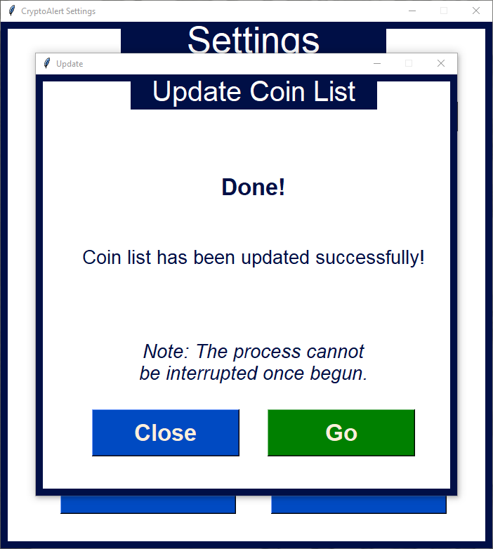
  </tr>
 </table>
 
## Moving Forward ##
- Further testing and implementation of more specific exception handling
- Implement prompt for "sender" email info, without suer having to edit config.txt
- Allow user to interrupt updating the coin list (threading)
- Allow user to create custom coin lists from within the program, without having to edit cryptos.csv
- Prepare for v2 -> querying API for price data instead of scraping html
